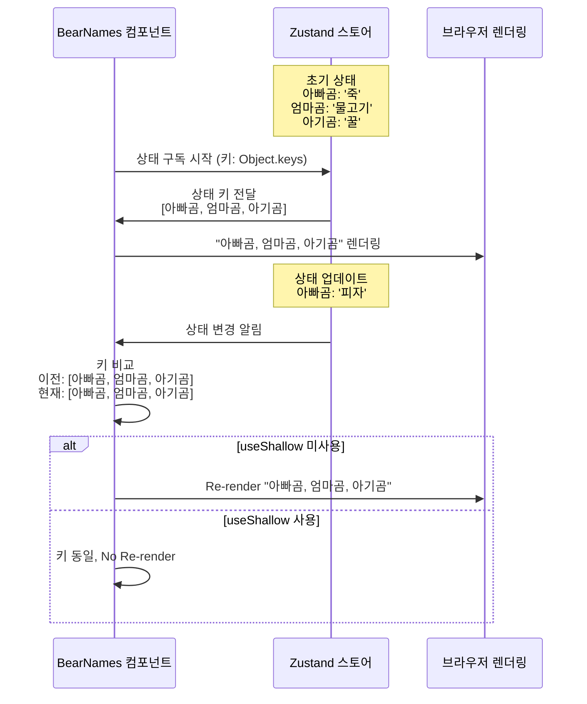

`npm install zustand`
state관리용 js 파일을 생성하고, 관리하고자 하는 state, state 변경용 메서드를 선언합니다.
```javascript
import { create } from 'zustand';

const useMapStore = create((set) => ({

    cesiumViewer: null,

    setCesiumViewer: (viewer) => set(() => ({ cesiumViewer: viewer })),

}))

export default useMapStore;
```
여러 메서드를 둘 수 있으며, set을 통해 state를 불변적으로 업데이트(상태 병합) 합니다.
```javascript
set((state) => ({ count: state.count + 1 }))
```
하나의 level에서는 스프레드 연산자를 생략할 수 있습니다.(2level 생략X)
```javascript
// 1level의 count
count: 0,
// 2level의 coordinates
coordinates: {lon: null, lat: null}
// 실제 동작
set((state) => ({ ...state, count: state.count + 1 }))
// 아래와 같이 생략 가능
set((state) => ({ count: state.count + 1 }))
// 2level 이상이라면 생략 불가능
set((state) => ({ coordinates: { ...state.coordinates.lon, 0} }))
```
Store에 담고있는 state가 변경될 때마다,

해당 Store를 구독하고 있는 컴포넌트들의 불필요한 Re-render가 진행되는 것을

`useShallow`로 방지할 수 있습니다.

```javascript
// 여러 컴포넌트에서 useMeals를 구독하고 있을 때를 가정하겠습니다.
const useMeals = create(() => ({
  아빠곰: '죽',
  엄마곰: '물고기',
  아기곰: '꿀',
}))
// 하나의 state를 변경하면
// 새로운 배열을 생성합니다.
useMeals.setState({
  아빠곰: '피자',
})
// useShallow 없이 구독한 컴포넌트는 Re-render되지만,
useMeals((state) => Object.keys(state))
// useShallow를 사용하여 구독한 컴포넌트는,
// 얕은 비교를 통해 Object.key 결과가 동일한지 확인하여
// [아빠곰, 엄마곰, 아기곰] --> 상태변경--> new [아빠곰, 엄마곰, 아기곰]
// (새로운 배열이지만, 결과는 동일합니다)
// Re-render를 방지할 수 있습니다.
useMeals(useShallow((state) => Object.keys(state)))
```
아래는 위 예시를 설명하는 시퀀스 다이어그램입니다.

state 변경이 자주 발생할 경우 subscribe와 useEfffect(언마운트 시 자동 구독 해제를 위해)를 통해

Transient Updates를 처리할 수 있습니다.
```javascript
const useScratchStore = create((set) => ({ scratches: 0, ... }))

const Component = () => {
  
  const scratchRef = useRef(useScratchStore.getState().scratches)
  
  useEffect(() => useScratchStore.subscribe(
    state => (scratchRef.current = state.scratches)
  ), [])
  ...
}
```